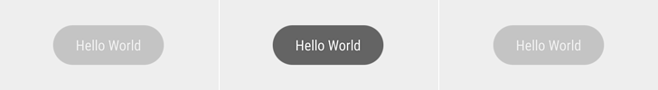

# NativeScript Toast Plugin

[](https://travis-ci.org/TobiasHennig/nativescript-toast)
 [](http://badge.fury.io/js/nativescript-toast)

> A NativeScript Toast Plugin for Android and iOS apps.

[](https://nodei.co/npm/nativescript-toast/)

## What is a toast?

> A toast provides simple feedback about an operation in a small popup. It only fills the amount of space required for the message and the current activity remains visible and interactive. - [Android Developer](http://developer.android.com/guide/topics/ui/notifiers/toasts.html)



## Demo

How to install and use this plugin? Watch it on [YouTube](https://www.youtube.com/watch?v=2RWtX4crzyE)!

Want simple example application to play with? [nativescript-toast-example](https://github.com/TobiasHennig/nativescript-toast-example)

## Installation

Run the following command from the root of your project:

```
$ tns plugin add nativescript-toast
```

Or the develop version, which may **not working** completly:

```
$ tns plugin add nativescript-toast@next
```

## Usage

```js
var Toast = require("nativescript-toast");

// ...

var toast = Toast.makeText("Hello World");
toast.show();
```
Or via import:

```js
import * as Toast from 'nativescript-toast';

// ...

var toast = Toast.makeText("Hello World");
toast.show();
```

It is also possible to chain the methods.
```js
Toast.makeText("Hello World").show();
```

Pass `"long"` to the `makeText` function to show the toast a bit longer.
```js
Toast.makeText("Hello World", "long").show();
```

## Development

* Android SDK
* Xcode 8+

[](http://badge.fury.io/js/nativescript-toast)
